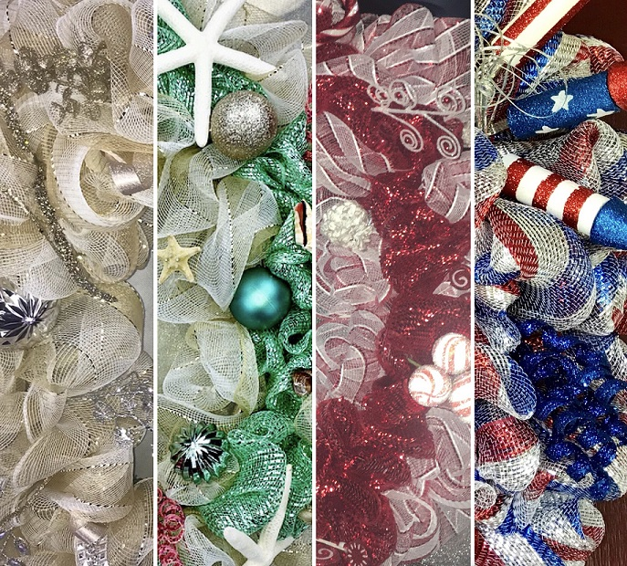

<!DOCTYPE html>
<html lang="en">

  <head>
    <meta charset="utf-8"/>
    <title>LeeLees Wreaths</title>

      <link rel="stylesheet prefetch" href="https://maxcdn.bootstrapcdn.com/font-awesome/4.6.1/css/font-awesome.min.css">
      <link rel="stylesheet prefetch" href="https://fonts.googleapis.com/css?family=Coda">
      <link rel="stylesheet" media="screen" href="https://fontlibrary.org/face/dancing-font" type="text/css"/>
      <link rel="stylesheet" media="screen" href="https://fontlibrary.org/face/grundschrift" type="text/css"/>
      <link rel="stylesheet" href="css/wreaths.css">

  </head>

  <body>
    <header>
      <h1 align="center">Leelee's Wreaths & Decor</h1>
    </header>

    <nav class="buttons" id="navbar" align="center">
      <button class="push"><a href="file:///C:/Users/Laptop/Documents/Atom/LWD/pics.html">View Wreaths</a></button>
      <button class="push">About</button>
      <button class="push">Custom Order</button>
      <button class="push">Contact Me</button>
    </nav>

    

      </img>

    

    

      
Hello! Thank you for visiting my page! My name is Elise. I have always been pretty creative
        and crafty. I started making wreaths as a Christmas activity/tradition with my daughters about
        five years ago. I didn't really have enough money to go get anything besides our real Christmas tree.
        It was our first Christmas in our home after starting life over, and I knew they were
        concerned we didn't have much for decorating, but I was going to make everything
        perfect for them. So I had some of the branches cut from the bottom and used whatever extra
        ornaments and gift wrapping ribbon I could find to make a wreath. I told my girls we would
        have a real wreath to go
        with our real tree. Honestly, it wasn't much worth looking at, but my girls were so
        excited that we had made it. Over the next few years, I had a little more to add to each wreath.
        Friends and family started commenting on how beautiful they were and asking me to make wreaths for
        them. Last year, I decided to turn it into <b>Leelee's Wreaths & Decor</b> (after my nephew's
        nickname for me). I love making them and seeing how happy they make other people, and I love
        how much my little business has already grown over the last year. Thank you again for stopping by!
        And feel free to message me with any questions or custom requests! 

  </body>
</html>

